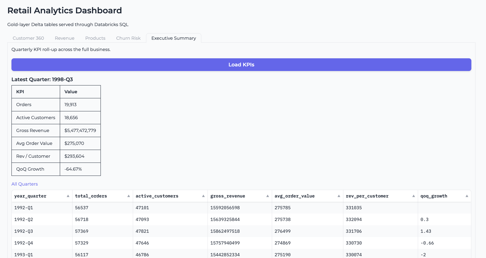

# Retail Lakehouse Demo

End-to-end retail analytics on Databricks, from TPC-H data generation through
Medallion Architecture, ML models, AI agents, and interactive applications.

Packaged as a **Databricks Asset Bundle** for one-command deployment.

---

## What's in the box

This project builds a complete analytics stack on a single Databricks workspace
using TPC-H benchmark data as the source. It covers the full lifecycle:
data engineering, ML, real-time serving, and user-facing applications.

| Layer | What it does |
|---|---|
| Data generation | Synthetic TPC-H data (1 GB to 100 GB), pure PySpark |
| Medallion pipeline | Bronze → Silver → Gold with Delta Lake, liquid clustering, quality constraints |
| SQL analytics | 12 production-ready queries on Gold tables (window functions, CTEs, pivots) |
| ML models | Customer churn prediction + demand forecasting, logged to MLflow |
| Online serving | Lakebase (PostgreSQL), Feature Store, Vector Search |
| AI agent | Tool-calling LLM backed by UC SQL functions |
| BI | Lakeview dashboard, Genie Space for natural-language Q&A |
| App | Gradio web app deployed as a Databricks App |

### Databricks App -- Retail Analytics Dashboard



---

## Architecture

```
┌─────────────────────────────────────────────────────────────────────────┐
│                        DATA GENERATION                                  │
│  00_generate_data  →  TPC-H benchmark (1 GB → 100 GB, pure PySpark)   │
└───────────────────────────────┬─────────────────────────────────────────┘
                                │
┌───────────────────────────────▼─────────────────────────────────────────┐
│                     MEDALLION ARCHITECTURE                              │
│  01_bronze_layer  →  02_silver_layer  →  03_gold_layer                 │
│  (raw + audit)       (dim/fact, SCD)     (KPIs, RFM, scorecards)       │
└───────────────────────────────┬─────────────────────────────────────────┘
                                │
          ┌─────────────────────┼──────────────────────┐
          │                     │                      │
┌─────────▼──────────┐ ┌───────▼────────┐ ┌───────────▼──────────┐
│  05  LAKEBASE      │ │  06  AI / ML   │ │  04  SQL ANALYTICS   │
│  Online serving    │ │  Churn model   │ │  12 analytical       │
│  Feature Store     │ │  Demand        │ │  queries on Gold     │
│  Vector Search     │ │  forecasting   │ │                      │
└─────────┬──────────┘ └───────┬────────┘ └──────────────────────┘
          │                     │
┌─────────▼─────────────────────▼────────────────────────────────┐
│  07  AI AGENT         08  DASHBOARD          09  APP           │
│  6 UC SQL tools       Lakeview + Genie       Gradio web app    │
│  Llama 3.3 70B        Self-serve Q&A         Customer 360      │
└────────────────────────────────────────────────────────────────┘
```

---

## Repository layout

```
retail-lakehouse-demo/
├── databricks.yml               # Asset Bundle config (jobs, targets)
├── README.md
├── CONTRIBUTING.md
├── CHANGELOG.md
├── .gitignore
└── src/
    ├── notebooks/
    │   ├── 00_generate_data.ipynb       # TPC-H data gen (pure PySpark)
    │   ├── 01_bronze_layer.ipynb        # Raw ingestion + audit columns
    │   ├── 02_silver_layer.ipynb        # Dim/fact tables, conformance
    │   ├── 03_gold_layer.ipynb          # Aggregations, RFM, scorecards
    │   ├── 05_lakebase_serving.ipynb    # Lakebase, Feature Store, VS
    │   ├── 06_ai_ml_models.ipynb        # Churn + demand forecasting
    │   ├── 07_ai_agents.ipynb           # Tool-calling AI agent
    │   ├── 08_ai_bi_dashboard.ipynb     # Lakeview dashboard + Genie
    │   └── 09_databricks_app.ipynb      # Gradio app deployment
    ├── sql/
    │   └── 04_gold_analytics.sql        # 12 analytical SQL queries
    └── app/
        ├── app.py                       # Standalone Gradio application
        ├── app.yaml                     # App runtime config
        └── requirements.txt             # App Python dependencies
```

---

## Prerequisites

- Databricks workspace with Unity Catalog enabled
- Serverless compute (all notebooks are serverless-compatible)
- A SQL Warehouse (Pro or Serverless) for Genie and the app
- Databricks CLI v0.218+ ([install instructions](https://docs.databricks.com/en/dev-tools/cli/install.html))

---

## Getting started

### Deploy with Asset Bundles

```bash
git clone https://github.com/anagilla/retail-lakehouse-demo.git && cd retail-lakehouse-demo

databricks configure --profile retail-demo
databricks bundle validate -t dev
databricks bundle deploy -t dev

# Run pipelines in order
databricks bundle run retail_data_pipeline -t dev
databricks bundle run retail_ml_pipeline -t dev
databricks bundle run retail_ai_experiences -t dev
```

### Or run notebooks interactively

Import `src/notebooks/` into your workspace and run in order (00 → 09).
Each notebook is self-contained with inline `%pip install` commands.

| Step | Notebook | ~Time (SF=1) | Purpose |
|------|----------|-------------|---------|
| 0 | `00_generate_data` | 3 min | TPC-H data generation |
| 1 | `01_bronze_layer` | 2 min | Raw ingestion with audit columns |
| 2 | `02_silver_layer` | 3 min | Dimension/fact modelling |
| 3 | `03_gold_layer` | 3 min | KPI aggregations |
| 4 | `04_gold_analytics.sql` | 1 min | Run in SQL editor |
| 5 | `05_lakebase_serving` | 5 min | Lakebase + Feature Store |
| 6 | `06_ai_ml_models` | 5 min | Churn + forecasting models |
| 7 | `07_ai_agents` | 2 min | AI agent with tool-calling |
| 8 | `08_ai_bi_dashboard` | 1 min | Lakeview dashboard + Genie |
| 9 | `09_databricks_app` | 3 min | Deploy Gradio web app |

---

## Configuration

Notebooks auto-detect the current catalog via `spark.catalog.currentCatalog()`.
Schemas created:

| Schema | Purpose |
|---|---|
| `tpch` | Raw TPC-H tables |
| `retail_bronze` | Bronze layer (raw + audit) |
| `retail_silver` | Silver layer (dim/fact) |
| `retail_gold` | Gold layer (aggregations) |
| `retail_serving` | Online serving tables |
| `retail_agent_tools` | UC SQL functions for the AI agent |

To change the data volume, edit `SCALE_FACTOR` in `00_generate_data.ipynb`:

```python
SCALE_FACTOR = 1     # 1 GB  (~8M rows in lineitem)
SCALE_FACTOR = 10    # 10 GB (~60M rows)
SCALE_FACTOR = 100   # 100 GB (~600M rows)
```

---

## Lakebase setup

Notebook 05 pushes Gold tables to Lakebase for low-latency serving.
Before running:

1. Go to **Catalog > Database Instances > Create**
2. Create a sandbox instance
3. Copy the connection string into notebook 05 when prompted

---

## Genie Space setup

Notebook 08 prints full instructions for manual Genie setup (~2 minutes):

1. **AI/BI > Genie Spaces > New Space**
2. Add the 8 Gold tables listed in the notebook output
3. Paste the curated instructions and sample questions

---

## Cleanup

```bash
databricks bundle destroy -t dev
```

Or drop schemas manually:
```sql
DROP SCHEMA <catalog>.tpch CASCADE;
DROP SCHEMA <catalog>.retail_bronze CASCADE;
DROP SCHEMA <catalog>.retail_silver CASCADE;
DROP SCHEMA <catalog>.retail_gold CASCADE;
DROP SCHEMA <catalog>.retail_serving CASCADE;
DROP SCHEMA <catalog>.retail_agent_tools CASCADE;
```

---

## Scaling

The demo runs at SF=1 (1 GB) for fast iteration. For load testing:

1. Set `SCALE_FACTOR = 100` in notebook 00
2. Use a multi-node cluster (the bundle config includes a 2-worker cluster)
3. Enable Predictive Optimization on Gold tables
4. Schedule the data pipeline job on a cron trigger

---

## Contributing

See [CONTRIBUTING.md](CONTRIBUTING.md).
